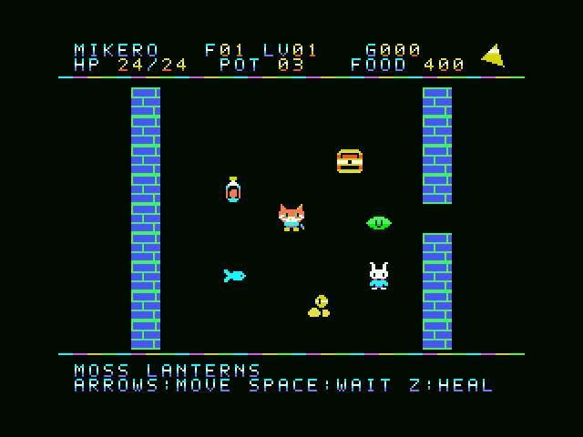

# MIKERO-ODYSSEY

A 30-floor, turn-based cat dungeon adventure for the original MSX.

猫のミケロで地下30階に挑む、スコアトライアル型のローグゲームです。初公開版は **v1.5.5-test**。ゲームバランスは調整中です。



## Download / 起動

[Releases](https://github.com/kanon-ai/MIKERO-ODYSSEY/releases) からROMまたはWindows用ZIPをダウンロードしてください。ZIPを展開し、`START.cmd` を実行します。このリポジトリから起動する場合は `game/START.cmd` です。

openMSXとC-BIOSは別途必要です。同梱していません。必要に応じて `OPENMSX_EXE` と `OPENMSX_SYSTEM_DATA` を設定できます。他のMSXエミュレーターではROMを **ASCII16** として読み込みます。

## Controls / 操作

- 矢印キー／ジョイスティック：移動、隣の敵へ肉球攻撃
- SPACE／ボタン1：開始・待機・再挑戦
- Z／ボタン2：手持ちの回復薬
- Keeperに隣接して、その方向へ移動：金貨5枚で全回復

右上の三角は階段のおおよその方角です。壁を避ける道順ではありません。最終階は王冠の方角を示します。

移動表示は8ドットずつ2段階。1行動で短い2声の音楽が進み、操作を止めると静かになります。旋律は64行動で一巡します。敵は白い煙になって退場し、ミケロが力尽きるとKeeperの短い担架演出を挟んで結果画面へ進みます。

各階のKeeperは1人。30階のスライムキングを倒して王冠を取ると完走です。終了時にスコア・到達階・ハイスコアを表示します。ハイスコアは再挑戦をまたいで保持しますが、電源OFFで消えます。

[日本語マニュアル](docs/manual-ja.md) · [BGM試聴](docs/action-march.wav) · [効果音試聴](docs/effects-preview.wav)

## Build

Python 3 and SDCC (including `sdasz80`) are required. Put SDCC on PATH or set `SDCC_BIN` to its bin directory.

```console
python work/source/build.py
```

The output is `outputs/MIKERO-ODYSSEY.rom`: exactly 512 KiB, ASCII16, MSX1, 32 KiB main RAM and 16 KiB VRAM. Graphics and dungeon data are generated by the included Python sources.

## Validation / 検証範囲

Current-ROM NTSC/PAL checks cover all eight compass directions, target changes between floors, bottom-row controls, and the two-stage scroll. The packaged sources reproduce the ROM byte for byte. Emulator test scripts are in `work/tools` and require external openMSX/C-BIOS and Pillow.

[Compass checks](docs/compass-verification.json) · [Scroll checks](docs/scroll-verification.json) · [Build report](docs/build-report.json) · [Rebuild check](docs/rebuild-verification.json)

Historical tests retain their original hashes in `docs/baseline-validation`. The audio examples were recorded from v1.5-test, whose music/effects are retained in this version. Physical MSX hardware and speakers have not been tested. A complete 30-floor input-only clear and the overall game balance have not been verified.

## Music

The music is an original PSG arrangement and variation based on Tchaikovsky's *The Nutcracker Suite*, Op.71a, Marche, using his historical piano score. No commercial recordings are used.

[Score and public-domain listing](https://imslp.org/wiki/The_Nutcracker_(suite),_Op.71a_(Tchaikovsky,_Pyotr))

No emulator binaries or BIOS ROMs are included.
