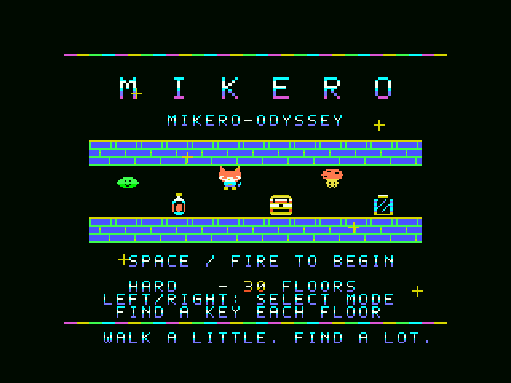
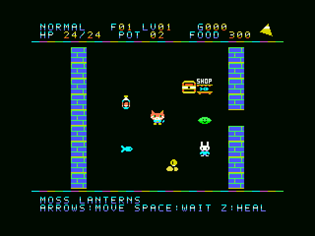
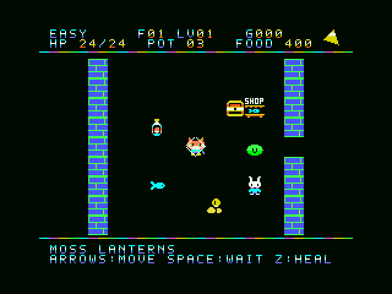

# MIKERO-ODYSSEY v1.7.1

正式版 **v1.7.1**。FOODが0になった後のHP減少を20行動ごとに調整しました。ショップ・探索スコア・HARDの鍵ルールも搭載しています。

[正式版をダウンロード](https://github.com/kanon-ai/MIKERO-ODYSSEY/releases/tag/v1.7.1) · [旧版 v1.6.1-test](https://github.com/kanon-ai/MIKERO-ODYSSEY/releases/tag/v1.6.1-test) · [操作・ルール・ビルド方法](docs/manual-ja.md)

猫のミケロが、迷宮に迷い込んだ生物を肉球で元の世界へ送り返し、異世界の門を閉じる冒険です。
初代MSX、512KB ASCII16 ROM、メインRAM32KB、VRAM16KB。原因不明の門、ウサギのKeeper、担架の救出演出はそのままです。

## 今回の変更

- FOODが0の間は20行動ごとにHP−1（全難易度共通）。魚・ショップ・次階の補給で空腹カウントをリセット。
- 食料があるときの消費・自然回復、敵や罠のダメージは従来どおり。

- EASYは15階。NORMALとHARDは30階。
- HARDはNORMALと同じ戦闘・補給設定に、各階の鍵探索を追加。踏むだけで取得し、階段で自動使用。
- 入口のショップは25金貨で食料100、各階1個のみ。売り切れ後の再訪・待機でも補充なし。
- 初めて踏むマスに探索スコア+1。食料の減り方は変更せず、往復では加点しません。
- NORMAL/HARDの床の魚を各階4個に調整。EASYの床の補給は従来どおり。
- 結果画面に探索マス数、3難易度別の記録。BGM・効果音・移動方式は維持。

## 画面

画像・GIFはv1.7と同一ROMの難易度テスト版をopenMSXで収録したものです。v1.7.1では空腹ダメージのみを変更し、画面と移動速度は同じです。GIFはEASYの実際のキー操作を約14秒、実速度・無音で収録しています。

## 起動

配布ZIPは展開してSTART.cmdを起動してください。リポジトリからはgame/START.cmdです。
外部のopenMSX・C-BIOSが必要です。他のエミュレーターはROMをASCII16で読み込みます。
旧版の途中状態を復元せず、最初から開始してください。左右でモード選択、SPACEで開始。
矢印で移動・肉球、SPACEで待機、Zで回復。Keeperとショップは隣から方向入力で利用できます。

## 検証

[v1.7.1の空腹調整検証](docs/starvation-verification.json) · [再ビルド一致](docs/rebuild-verification.json)

以下のゲーム全体の記録はv1.7時点のものです。

[ショップ・探索](docs/exploration-verification.json) · [HARD・鍵・記録](docs/hard-verification.json) · [全120地形×3モード](docs/layout-verification.json) · [スクロール](docs/scroll-verification.json)

[HARDの5階通過](docs/campaign-hard-0-prepared.json) · [HARD追加前のNORMAL通し確認](docs/campaign-normal-before-hard.json) · [ビルド](docs/build-report.json) · [収録情報](docs/media-verification.json)

自動操作は全マップを参照しています。人が感じる難易度の保証ではありません。HARDの30階完走、実機での動作は未確認です。
過去版の検証ファイルは当時のROMハッシュを保持しています。この版の検証は上記リンクを参照してください。

## 音楽と世界観

BGMはチャイコフスキー『くるみ割り人形』行進曲をもとにした独自のPSG編曲で、市販音源は使っていません。
行動時にフレーズが進み、操作を止めると余韻の後に静かになります。
[参照楽譜](https://imslp.org/wiki/The_Nutcracker_(suite),_Op.71a_(Tchaikovsky,_Pyotr)) · [世界観](docs/world-setting-ja.md)
