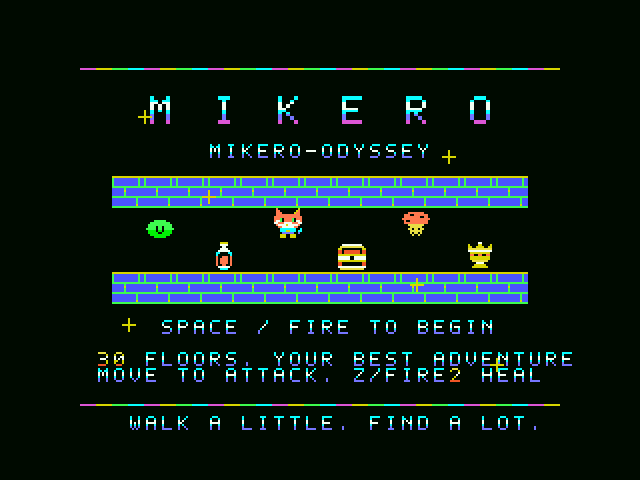

# MIKERO-ODYSSEY

A turn-based, 30-floor dungeon adventure for the original MSX. Play as Mikero the cat, meet a rabbit Keeper, and follow a melody that advances with your footsteps.



猫のミケロと潜る、全30階のトライアル型ローグゲームです。肉球でポンと攻撃し、敵は白い煙になって退場。静かな黒い床と、色鮮やかなキャラクターが特徴です。

## Play / 遊び方

Windowsでは `game/START.cmd` をダブルクリックしてください。別途openMSXとC-BIOSが必要です。同梱はしていません。
他のMSXエミュレーターでは `game/MIKERO-ODYSSEY.rom` をASCII16として読み込みます。

- カーソル／ジョイスティック：移動・隣の敵へ肉球攻撃
- SPACE／ボタン1：開始・待機・再挑戦
- Z／ボタン2：回復薬
- ウサギのKeeper：金5枚で全回復

30階で王冠を取ると完走。途中で力尽きてもスコアと到達階を表示します。ハイスコアは再挑戦をまたいで保持しますが、電源OFFやエミュレーター終了で消えます。

歩くごとに『くるみ割り人形』の「行進曲」の旋律が1音進みます。止まると短く消え、壁・待機・その場の攻撃では進みません。[操作・得点・楽曲出典の詳細](docs/manual-ja.md)

## Build

Python 3 and SDCC (including `sdasz80`) are required. Put SDCC on PATH, or set `SDCC_BIN` to its bin directory.

```console
python work/source/build.py
```

The resulting `outputs/MIKERO-ODYSSEY.rom` is exactly 512 KiB. Target: MSX1, ASCII16 cartridge mapper, 32 KiB main RAM and 16 KiB VRAM. All graphics and dungeon data are generated by the included Python sources.

## Validation

- NTSC/PAL checks cover movement-triggered PSG tones, silence, scores and restart records.
- All 30 floor-loading transitions and the final completion path were tested separately with controlled fixtures.
- A keyboard-only automated run ended on floor 14 with 6,800 points. A complete 30-floor keyboard-only clear has **not** been verified.
- The final title-only update was checked in the emulator. Earlier functional reports retain their original ROM hashes in `docs/baseline-validation`; they are not presented as tests of a different binary.
- Physical MSX hardware and speakers have not been tested.

[Title update verification](docs/title-verification.json) · [Baseline verification](docs/baseline-validation) · [Recorded walking melody](docs/walking-march.wav)

The melody is a new PSG transcription of the opening upper voice in Tchaikovsky's own historical piano score. No commercial recordings, emulator binaries, BIOS ROMs or third-party game assets are included.
